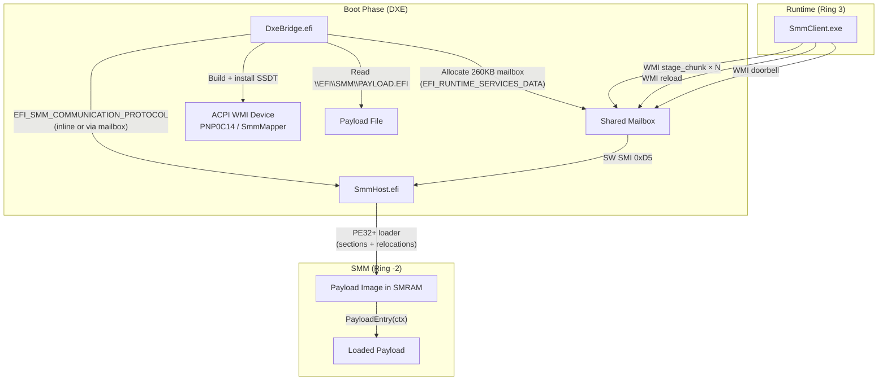

# SmmMem

Driverless Windows memory access through System Management Mode (SMM) with a user-mode API.

## Overview

SmmMem exposes a small Windows client API that can read, write, translate, and resolve memory without installing a kernel driver. The user-mode client talks to an ACPI WMI method, which copies a request into a shared mailbox and rings a software SMI doorbell. The SMM handler then performs the requested operation from Ring −2 and writes the response back to the mailbox.

> **Research and safety scope.** This repository is a firmware-security research PoC. It must only be used on hardware owned by the operator, with explicit authorization and a recovery path for firmware failure. The project currently exposes highly privileged memory and payload-loading capabilities; it is not suitable for production systems.

## Table of Contents

- [Overview](#overview)
- [Repository Layout](#repository-layout)
- [Architecture](#architecture)
- [Request Flow](#request-flow)
- [Communication Details](#communication-details)
- [What the SMM Side Does](#what-the-smm-side-does)
- [User-Mode API](#user-mode-api)
- [Building](#building)
- [Firmware Installation](#firmware-installation)
- [Platform Notes](#platform-notes)
- [Debug Build (`src_dbg01`)](#debug-build-src_dbg01)
- [Mapper (`mapper/`)](#mapper-mapper)
- [Security and Detection](#security-and-detection)
- [Implementation Roadmap](#implementation-roadmap)
- [Conventions](#conventions)
- [Troubleshooting](#troubleshooting)
- [Notes and Limitations](#notes)

The repository contains three independent firmware trees:

- `src`: release-oriented firmware (Dxe.efi + Smm.efi) and a Windows client library providing 11 memory access primitives
- `src_dbg01`: debug build with extra firmware tracing via UEFI variables and a Windows debug reader
- `mapper`: dynamic payload mapper — loads arbitrary PE32+ payloads into SMRAM at runtime, with hot-reload from user-mode via WMI

The `src/` and `mapper/` trees can coexist in the same firmware image (they use separate SW SMI values and WMI GUIDs).

## Repository Layout

### `src`

- `Dxe.c`: allocates the mailbox, publishes configuration, builds and installs the ACPI SSDT/WMI device, and attempts to configure the SMM side through `EFI_SMM_COMMUNICATION_PROTOCOL`
- `Smm.c`: registers the configuration communication handler and software SMI handler, translates addresses, walks page tables, locates processes/modules/exports, and services requests from the mailbox
- `Client.c`: user-mode transport and API implementation based on `Advapi32!WmiOpenBlock` and `WmiExecuteMethodW`
- `Api.h`: public C API for user applications
- `Common.h`: shared protocol, structure, GUID, command, and firmware type definitions
- `build.cmd`: builds `Dxe.efi`, `Smm.efi`, and the sample client

### `src_dbg01`

The debug tree mirrors the release tree and adds firmware instrumentation:

- `DbgRead.c`: Windows utility that reads firmware debug variables, scans ACPI tables for the SmmMem WMI markers, and sends a WMI ping
- `Dxe.c`: debug-capable DXE that stores installation/configuration progress in firmware variables
- `Smm.c`: debug-capable SMM module that stores SMM initialization and configuration state in firmware variables
- `Common.h`: extended with debug structures, stage identifiers, and the debug variable GUID
- `build.cmd`: builds `DbgRead.exe` in addition to the normal binaries

### `mapper`

Dynamic payload mapper — loads, reloads, and manages arbitrary PE32+ payloads inside SMRAM at runtime:

- `DxeBridge.c`: DXE-phase bridge that allocates the shared mailbox, builds and installs a WMI doorbell SSDT, reads an initial payload from `\EFI\SMM\PAYLOAD.EFI`, and delivers it to the SMM host via `EFI_SMM_COMMUNICATION_PROTOCOL`
- `SmmHost.c`: SMM-phase host that receives payloads via communication handler or WMI hot-reload, parses PE32+ images (sections, relocations), maps them into SMRAM, and dispatches lifecycle events (load/unload/doorbell)
- `SmmClient.c`: Windows user-mode CLI that communicates with the SMM host via WMI — supports `ping`, `status`, `doorbell`, `unload`, and `reload <path>` commands
- `Payload.c`: minimal sample payload demonstrating the payload ABI (handles LOAD, UNLOAD, and DOORBELL reasons)
- `PayloadAbi.h`: payload-side ABI header defining `PAYLOAD_CONTEXT` and callback function pointers
- `build.cmd`: builds `DxeBridge.efi`, `SmmHost.efi`, `Payload.efi`, and `SmmClient.exe`

## Architecture

SmmMem is split into two firmware components and one Windows client:

1. **DXE module (`Dxe.efi`)**
   - Allocates a 0x2000-byte runtime mailbox
   - Publishes mailbox configuration through a UEFI configuration table
   - Builds an SSDT that exposes an ACPI WMI device (`PNP0C14`)
   - Installs the ACPI table and retries setup if ACPI or SMM communication is not ready yet
   - Sends the mailbox configuration to SMM through `EFI_SMM_COMMUNICATION_PROTOCOL`

2. **SMM module (`Smm.efi`)**
   - Locates SMST and registers a config communication handler
   - Accepts mailbox configuration from either the communication buffer or the published configuration table
   - Registers a software SMI handler for the configured SW SMI value (`0xD6`)
   - Services memory and symbol requests directly from SMM

3. **Windows user-mode client**
   - Opens the WMI block with `WmiOpenBlock`
   - Executes ACPI WMI method ID `1` with `WmiExecuteMethodW`
   - Uses a fixed request/response layout shared with firmware

## Request Flow

The effective flow implemented by the source tree is:

`Usermode application -> WmiExecuteMethodW -> ACPI WMI method -> shared mailbox -> software SMI -> SMM handler -> response mailbox -> usermode`


## Communication Details

The shared protocol is defined in `Common.h` and mirrored in `Client.c`:

- Mailbox size: `0x2000`
- Request buffer: first `0x1000`
- Response buffer: starts at offset `0x1000`
- WMI request size: `4096` bytes
- WMI response size: `512` bytes
- `src/` response data capacity: `352` bytes
- SW SMI value: `0xD6`
- WMI GUID: `A0C9F8DE-0B71-42A8-B967-E538EACB6F21`

Supported commands:

- `CMD_PING`
- `CMD_READ_PHYS`
- `CMD_WRITE_PHYS`
- `CMD_TRANSLATE_VIRT`
- `CMD_READ_VIRT`
- `CMD_WRITE_VIRT`
- `CMD_FIND_PROCESS_PID`
- `CMD_FIND_PROCESS_NAME`
- `CMD_FIND_MODULE`
- `CMD_FIND_KERNEL_MODULE`
- `CMD_FIND_EXPORT`

## What the SMM Side Does

The SMM handler in `src/Smm.c` and `src_dbg01/Smm.c` implements:

- physical memory reads and writes through SMM CPU I/O services
- CR3-based virtual-to-physical translation
- process discovery by PID or image name
- process CR3 and image base discovery
- user-module enumeration through the PEB loader lists
- kernel-module enumeration through `PsLoadedModuleList`
- export resolution from a selected module image

The implementation dynamically resolves several Windows structure offsets instead of hardcoding a single OS build layout.

## User-Mode API

The public API is declared in `Api.h`:

```c
Init();
Close();
Ping();

FindProcessByPid(pid, &process);
FindProcessByName("notepad.exe", &process);

TranslateVirt(pid, va, &pa);

ReadVirt(pid, va, buffer, size);
WriteVirt(pid, va, buffer, size);

ReadPhys(pa, buffer, size);
WritePhys(pa, buffer, size);

FindModule(&process, "module.dll", &module);
FindKernelModule("ntoskrnl.exe", &module);
FindExport(&module, "PsInitialSystemProcess", &address);

Dump(&module, callback, context);
```

Basic example:

```c
#include "Api.h"

int main(void) {
    PROCESS_INFO process = {0};
    char buffer[16] = {0};

    Init();
    FindProcessByName("notepad.exe", &process);
    ReadVirt(process.Pid, process.ImageBase, buffer, sizeof(buffer));
    Close();
    return 0;
}
```

When using `Client.c` as a library, define `API_ONLY` so the built-in sample `wmain` is excluded.

## Building

Open an **x64 Visual Studio Developer Command Prompt** and run one of the build scripts:

### Release tree

```bat
src\build.cmd
```

Run this command from the repository root.

Build output:

- `Work\build\Smm.efi`
- `Work\build\Dxe.efi`
- `Work\build\Client.exe`

### Debug tree

```bat
src_dbg01\build.cmd
```

Run this command from the repository root.

Build output:

- `Work\build\Smm.efi`
- `Work\build\Dxe.efi`
- `Work\build\Client.exe`
- `Work\build\DbgRead.exe`

For a custom Windows application, compile your code together with `Client.c` and define `API_ONLY`, for example:

```bat
cl /nologo /W4 /O2 /DUNICODE /D_UNICODE /DAPI_ONLY app.c src\Client.c
```

## Firmware Installation

1. Build the DXE and SMM binaries.
2. Insert `Dxe.efi` and `Smm.efi` into firmware for a target board that supports PI SMM.
3. Flash the modified firmware.
4. Boot Windows and monitor serial output for mailbox allocation, SSDT/WMI installation, SMM configuration, and SW SMI registration.
5. Run a user-mode client that calls `Init()` before issuing requests.

The DXE module is responsible for the mailbox and ACPI/WMI doorbell. The SMM module performs the actual memory work.

## Platform Notes

The codebase is written for:

- x64 UEFI firmware
- PI SMM implementations similar to AMI Aptio V environments
- Windows 10 or Windows 11 on the target OS side

The original project notes mention testing on an ASUS TUF X870 / AMD AM5 platform, with expected portability to Intel platforms that expose equivalent SMM services.

## Debug Build (`src_dbg01`)

The debug firmware stores progress in UEFI variables using GUID `8EF7C961-13F3-4574-B417-7D99A1A52A8D`.

Important variables:

- `SmmMemDebug`: DXE-side state
- `SmmMemSmmDebug`: SMM-side state
- `SmmMemTrace`: rolling trace of DXE stages

`DbgRead.exe`:

- enables `SeSystemEnvironmentPrivilege`
- reads those firmware variables with `GetFirmwareEnvironmentVariableExW`
- prints decoded stage names and status values
- scans ACPI tables for `SMMM`, `MEMDEV`, `WMBD`, and the WMI GUID markers
- issues a `CMD_PING` over WMI to confirm that the doorbell path works

Tracked debug stages include mailbox allocation, ACPI protocol lookup, SSDT generation and installation, SMM communication discovery, configuration delivery, SMST validation, config handler registration, and SW SMI registration.

## Mapper (`mapper/`)

The mapper extends SmmMem with a **dynamic payload loading system**. Instead of a monolithic SMM handler, the mapper splits the firmware into a host (`SmmHost.efi`) and a pluggable payload (`Payload.efi`) that can be loaded, unloaded, and hot-reloaded at runtime — even from a user-mode Windows process.

### Mapper Architecture



### Payload Lifecycle

The SMM host manages payloads through three lifecycle events:

| Reason | Value | When | Purpose |
|---|---|---|---|
| `REASON_LOAD` | 1 | Payload mapped and entry called for the first time | Initialize state, register SMI handlers |
| `REASON_UNLOAD` | 2 | Before payload is torn down | Cleanup, unregister handlers |
| `REASON_DOORBELL` | 3 | WMI doorbell command received | Runtime dispatch — the payload's main work |

### Payload ABI (`PAYLOAD_CONTEXT`)

Every payload receives a `PAYLOAD_CONTEXT` pointer with:

```c
typedef struct {
  UINT32                  Reason;               // LOAD, UNLOAD, or DOORBELL
  UINT32                  Generation;            // Increments on each reload
  UINT32                  PayloadSize;           // Size of the mapped PE image
  EFI_SYSTEM_TABLE       *SystemTable;          // UEFI system table (if available)
  EFI_SMM_SYSTEM_TABLE2  *Smst;                 // SMM system table
  SERIAL_PRINT            SerialPrint;           // COM1 debug output
  SERIAL_HEX64            SerialHex64;           // COM1 hex output
  REGISTER_SMI_HANDLER    RegisterSmiHandler;    // Tracked handler registration
  UNREGISTER_SMI_HANDLER  UnregisterSmiHandler;  // Tracked handler unregistration
  ALLOCATE_POOL           AllocatePool;          // Tracked SMRAM pool allocation
  FREE_POOL               FreePool;              // Tracked SMRAM pool free
  VOID                   *PayloadBase;           // Base of mapped image in SMRAM
  EFI_SMM_INTERRUPT_REGISTER   RawSmiHandlerRegister;   // Direct SMST register
  EFI_SMM_INTERRUPT_UNREGISTER RawSmiHandlerUnRegister; // Direct SMST unregister
  VOID                   *SmmLocateProtocol;     // SMST LocateProtocol
} PAYLOAD_CONTEXT;
```

The host **tracks** all SMI handlers and pool allocations made through the wrapped callbacks, automatically cleaning them up on unload. Payloads can also use the raw SMST functions for advanced use.

### Mapper Communication Protocol

The mapper uses its own WMI protocol, distinct from the memory-access protocol in `src/`:

| Command | Value | Direction | Description |
|---|---|---|---|
| `DOORBELL` | 1 | Client → SMM | Dispatch `REASON_DOORBELL` to the loaded payload |
| `PING` | 2 | Client → SMM | Health check; returns status |
| `STATUS` | 3 | Client → SMM | Returns loaded state, generation, and debug log |
| `UNLOAD` | 4 | Client → SMM | Unload the current payload |
| `STAGE_CHUNK` | 5 | Client → SMM | Upload a chunk of a new payload (up to 4000 bytes) |
| `RELOAD` | 6 | Client → SMM | Unload current payload, load staged payload |

The response carries status, payload generation counter, and up to 464 bytes of serial debug log captured during the command.

### Building the Mapper

```bat
mapper\build.cmd
```

Run this command from the repository root.

Build output:

- `Work\build\DxeBridge.efi`
- `Work\build\SmmHost.efi`
- `Work\build\Payload.efi`
- `Work\build\SmmClient.exe`

### Mapper Firmware Installation

1. Build `DxeBridge.efi` and `SmmHost.efi`.
2. Insert both modules into firmware (same method as `src/`).
3. Optionally place `Payload.efi` at `\EFI\SMM\PAYLOAD.EFI` on the EFI System Partition for automatic boot-time loading.
4. Flash the modified firmware and boot Windows.
5. Use `SmmClient.exe` to interact with the mapper.

### SmmClient Usage

```bat
:: Check connectivity
SmmClient.exe ping

:: Query mapper status (loaded, generation, debug log)
SmmClient.exe status

:: Send a doorbell event to the loaded payload
SmmClient.exe doorbell

:: Unload the current payload
SmmClient.exe unload

:: Hot-reload a new payload from Windows (no reflash needed)
SmmClient.exe reload C:\path\to\NewPayload.efi
```

The `reload` command uploads the payload in 4KB chunks over WMI, verifies a FNV-1a hash, unloads any existing payload, maps the new PE32+ image in SMRAM, and calls its entry point.

## Conventions

The `src/` and `mapper/` trees are **independent systems** with separate WMI GUIDs and SW SMI values:

| Parameter | `src/` (memory access) | `mapper/` (payload loader) |
|---|---|---|
| SW SMI value | `0xD6` | `0xD5` |
| WMI GUID | `A0C9F8DE-0B71-42A8-B967-E538EACB6F21` | `9B6F1A20-31D5-44DF-9A9C-157F4307914B` |
| WMI UID | `SMMM` | `SmmMapper` |
| Communication GUID | (in `Common.h`) | `2B29C9AD-2D8F-4F5E-974E-5DE5542E4031` |

Both can coexist in the same firmware image. They use different SMI dispatch values and separate mailbox allocations.

## Troubleshooting

If the project does not work on a target board:

- try the debug firmware from `src_dbg01`
- capture serial logs from the DXE and SMM modules
- run `DbgRead.exe` from an elevated Windows session
- record the motherboard model, firmware patching method, and whether ACPI markers and WMI ping succeeded

Common failure points visible in the source:

- ACPI table protocol not available when DXE first runs
- no usable SMM communication region table entry
- SMM communication protocol not ready yet
- configuration not accepted by SMM
- SW SMI registration rejected because the chosen SW SMI value is out of range

Mapper-specific failure points:

- `\EFI\SMM\PAYLOAD.EFI` not found on any mounted filesystem during DXE
- SMM communication region too small for inline payload delivery (falls back to mailbox staging)
- payload PE32+ image has imports (unsupported — payloads must be fully self-contained)
- payload image exceeds 768KB (SMRAM image buffer limit)
- all 16 tracked handler or pool slots exhausted by a payload

## Notes

- The project is designed around firmware-based access, not a Windows kernel driver.
- The SMM handler is event-driven; it only runs when an SMI is triggered.
- `Client.c` chunks `src/` memory transfers to the 352-byte response data field; the mapper stages payload chunks up to 4000 bytes per WMI request.
- The debug tree is the best starting point when adapting the project to a new motherboard or firmware layout.
- The mapper's payload hash uses FNV-1a 64-bit for integrity verification, not cryptographic authentication. Any user who can reach the WMI method can upload an arbitrary payload.
- All memory copy and zero functions (`CopyMem`, `ZeroMem`, custom `memcpy`/`memset`) have been optimized to use QWORD (64-bit) wide memory accesses. This greatly improves bulk operation throughput while maintaining zero CRT dependency.

## Security and Detection

SmmMem is intentionally easy to study as a defender. Its observable and auditable indicators include:

- firmware changes and unexpected DXE/SMM modules;
- dynamically installed ACPI/WMI devices, custom WMI GUIDs, UIDs, methods, and unusual mailbox sizes;
- software SMI registration and a repeatable WMI → mailbox → SMI request sequence;
- SMM execution latency, CPU rendezvous impact, and abnormal SMI frequency;
- arbitrary physical-memory access, page-table walking, process/module enumeration, and export resolution;
- the mapper's runtime PE loading, executable SMRAM image, hot reload, unsigned payloads, and FNV-1a-only integrity check;
- debug UEFI variables, serial traces, and firmware configuration-table markers.

### Defensive evaluation principles

1. Establish a clean firmware and OS baseline before each experiment.
2. Record firmware hashes, ACPI tables, WMI inventory, SMI counters/latency, and relevant Windows event/ETW telemetry.
3. Run only benign commands such as health checks and bounded reads against synthetic test data; do not use real credentials or third-party machines.
4. Compare SmmMem traces with a legitimate monitoring workload without trying to make SmmMem resemble it.
5. Preserve recovery media, SPI backup, serial output, and a board-specific reflashing procedure.

## Implementation Roadmap

This is the proposed implementation plan for the next phase. No code changes are implied by this section alone.

### Phase 0 — Scope and reproducibility

- [x] Define an authorized research scope and recovery procedure (`docs/RESEARCH_SCOPE.md`).
- [x] Define a test matrix: firmware version, motherboard, CPU, Secure Boot/VBS state, Windows build, and recovery method (`docs/TEST_MATRIX.md`).
- [x] Add a clean-room request-vector harness using bounded synthetic inputs and non-sensitive fixtures (`tools/validate_request_vectors.py`).
- [x] Document known claims that require verification, especially privilege requirements, Secure Boot behavior, and cross-platform compatibility (`docs/TEST_MATRIX.md`).

### Phase 1 — WMI transport and call-pattern work

- [x] Inventory the WMI providers present on the target and document which ACPI/WMI paths are available for a controlled research comparison (`tools/WmiProviderInventory.cpp`).
- [x] Evaluate existing providers as inventory data without substituting them for the project-owned diagnostic transport (`docs/WMI_TRANSPORT.md`).
- [x] Document stable identifiers, ownership, registration, and lifecycle for the project-owned transports (`docs/WMI_TRANSPORT.md`).
- [x] Define current mailbox boundaries and bounded request/response fragments; protocol changes remain a separate compatibility task (`docs/WMI_TRANSPORT.md`).
- [ ] Add an optional COM/WMI `ExecMethod` implementation for the privileged project channel — deferred pending an explicit protocol-compatibility design and isolated validation.
- [ ] Compare direct `WmiOpenBlock`/`WmiExecuteMethodW` with a COM project-channel transport — deferred with the COM implementation.
- [ ] Add a batch command for groups of memory operations — deferred to the safety-hardening and authorization design; the current benchmark remains ping-only.
- [x] Define configurable request pacing, bounded concurrency, and lifecycle-aware scheduling for repeatable experiments; keep defaults deterministic and observable (`tools/WmiPingBench.c`, ping-only).
- [x] Document the current transports, identifiers, request boundaries, and COM comparison rules (`docs/WMI_TRANSPORT.md`).
- [x] Add a bounded ping benchmark with CSV output and high-resolution elapsed-time measurement (`tools/WmiPingBench.c`).
- [x] Add a read-only COM/WMI inventory utility for `ROOT\WMI` (`tools/WmiInventory.cpp`).
- [x] Add a read-only provider inventory for `ROOT\CIMV2::__Win32Provider` (`tools/WmiProviderInventory.cpp`).
- [x] Add a snapshot comparison tool with normalized class/provider CSV output and change exit codes (`tools/compare_wmi_snapshots.py`).
- [x] Add an offline protocol consistency check covering request/response sizes, mailbox offsets, SMI values, GUIDs, and documented transport capacities (`tools/check_protocol_consistency.py`).

Build and run the benchmark from an x64 Visual Studio Developer Command Prompt:

```bat
tools\build.cmd
tools\Work\WmiPingBench.exe 30 0 > ping.csv
tools\Work\WmiInventory.exe > wmi-root-wmi.csv
py tools\check_protocol_consistency.py
```

The benchmark sends `CMD_PING` only. It does not perform memory reads/writes or
mapper payload operations. The output is intended to be collected on a prepared
lab target after the firmware and WMI path have been validated.

### Phase 1 completion note

The safe, observational portion of Phase 1 is complete: the project now has
transport documentation, class and provider inventories, snapshot comparison,
and a bounded ping benchmark with reproducible CSV output. The remaining
unchecked items are intentionally deferred because they would change the
privileged protocol or increase its operation density before authorization,
compatibility, and safety controls are defined. Phase 2 can proceed using the
current ping-only path and the inventory artifacts.

### Phase 2 — Baseline observability

- [x] Add request metadata to the ping benchmark: protocol, command, request size, response capacity, instance, and status (`tools/WmiPingBench.c`).
- [x] Measure WMI round-trip latency and SMM handler duration with clearly marked instrumentation; do not modify time sources (`src_dbg01` runtime counters and `tools/WmiPingBench.c`).
- [x] Record rejected requests, malformed mailbox sizes, invalid commands, and sequence anomalies (`src_dbg01` counters; payload hash failures remain mapper-specific; snapshot persisted every 64 requests).
- [x] Define a stable CSV/JSON result format and a reproducible benchmark command (`tools/summarize_ping.py`, schema `smmmem.wmi-ping.v1`).

### Phase 3 — SMM timing and execution hygiene

- [x] Instrument TSC timestamps at SMM handler entry and exit behind an explicit diagnostic build flag (`src_dbg01`).
- [ ] Separate mailbox validation/copy work from expensive translation, PE parsing, and symbol-resolution work wherever the firmware architecture permits; the current debug build only adds bounded checks and measurements.
- [x] Add a bounded request-cycle budget and explicit `EFI_TIMEOUT` status in the debug build (`src_dbg01`).
- [x] Add a one-entry, revalidated process metadata cache with invalidation on failed validation (`src_dbg01`, documented in `docs/SMM_TIMING.md`).
- [x] Measure per-request SMM duration, timeout status, and tail-latency inputs (`src_dbg01` counters and benchmark schema).
- [x] Document platform-specific SMI dispatch limitations and retain the standard registered software-SMI path as the fallback (`docs/SMM_TIMING.md`).
- [x] Keep all time sources unmodified; timing data is observational and auditable (`docs/SMM_TIMING.md`).

### Phase 4 — Defensive detection experiments

- [ ] Inventory ACPI/WMI objects before and after installation and produce a diff report.
- [ ] Build a lab-only detector for new PNP0C14 devices, WMI identifiers, AML markers, and suspicious mailbox/SMI relationships.
- [ ] Correlate WMI-Activity/ETW data with SMI latency and firmware debug records.
- [ ] Add a detector for mapper-specific behaviors: payload staging, reloads, executable SMRAM regions, and weak integrity authentication.
- [ ] Document false positives and detection blind spots.

### Phase 5 — Safety hardening

- [ ] Make write operations and arbitrary payload loading disabled by default in research builds.
- [ ] Add explicit authorization/configuration gates and fail closed on invalid or stale configuration.
- [ ] Replace unauthenticated FNV-1a payload acceptance with a documented cryptographic verification design, or remove runtime payload loading from the default build.
- [ ] Bound all copies, addresses, command sizes, retries, and handler execution time; test malformed and concurrent requests.
- [ ] Review mailbox lifetime, ACPI table installation, ExitBootServices behavior, and the temporary communication-region mutation.

### Phase 6 — Validation and documentation

- [ ] Run the matrix on disposable hardware or a firmware emulator where possible.
- [ ] Publish latency, throughput, failure, and detection results with raw reproducible artifacts.
- [ ] Add a Detection & Mitigation write-up covering firmware signing, measured boot, SMM Supervisor/STM, firmware integrity monitoring, and recovery.

### Cross-cutting acceptance criteria

- [ ] Every transport variant has a documented protocol description, ownership model, identifier registry, and rollback procedure.
- [ ] Every timing change is backed by before/after measurements collected without changing hardware time sources.
- [ ] Every batching, fragmentation, pacing, or caching change has correctness tests for ordering, timeouts, partial transfers, cancellation, and concurrent callers.
- [ ] Every platform-specific behavior is feature-detected and has a safe fallback.
- [ ] Every experiment produces enough metadata to reproduce the result and distinguish firmware, OS, transport, and workload effects.

### SMRAM Footprint

| Module | Static buffers | Notes |
|---|---|---|
| `src/Smm.efi` | ~56KB code+data | Monolithic SMM handler |
| `mapper/SmmHost.efi` | ~1MB (`gPayloadFile[256KB]` + `gPayloadImage[768KB]`) | Static buffers in SMRAM for PE loading |
| `mapper/DxeBridge.efi` | ~512KB (`gPayloadFile[256KB]` + `gCommBuffer[~256KB]`) | DXE-phase only, freed at ExitBootServices |

SMRAM is typically 8–16MB on consumer platforms. The mapper's ~1MB SMRAM footprint is significant but manageable.

### Known Limitations

- `DxeBridge.c` temporarily mutates the SMM Communication Region descriptor type from `EFI_CONVENTIONAL_MEMORY` to `EFI_RESERVED_MEMORY_TYPE` during payload delivery. It restores the original type afterward, but a crash between mutation and restore could leave a corrupted memory map.
- The mapper does not support PE32+ images that contain imports. Payloads must be fully self-contained.
- The tracked resource arrays in `SmmHost.c` are fixed-size (16 handlers, 16 pools). Payloads that exceed these limits will still function but lose automatic cleanup on unload.
